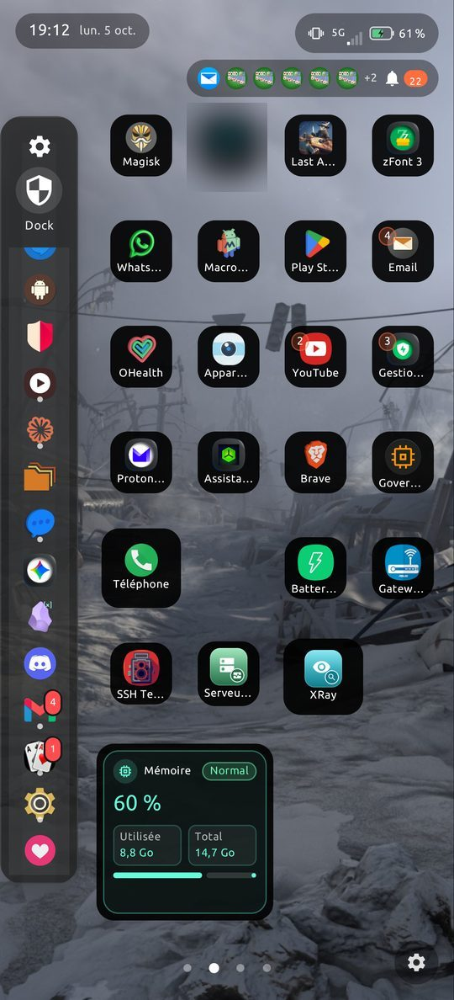
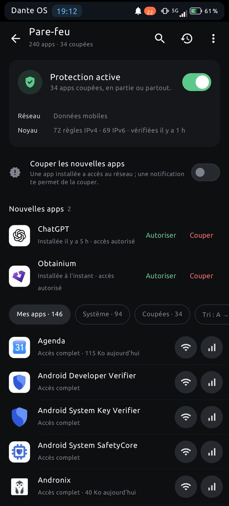
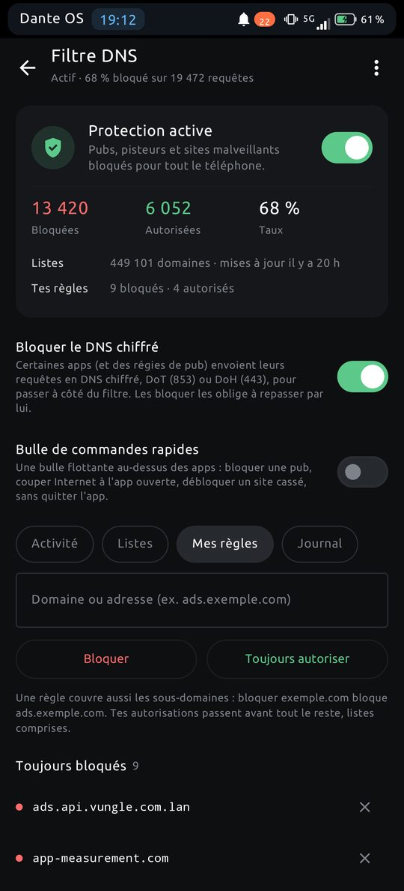
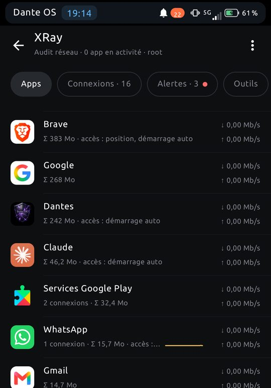
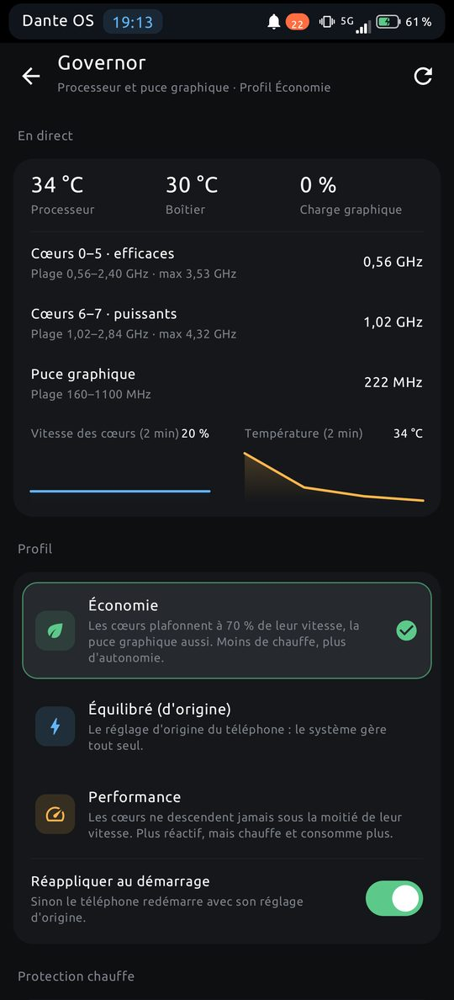
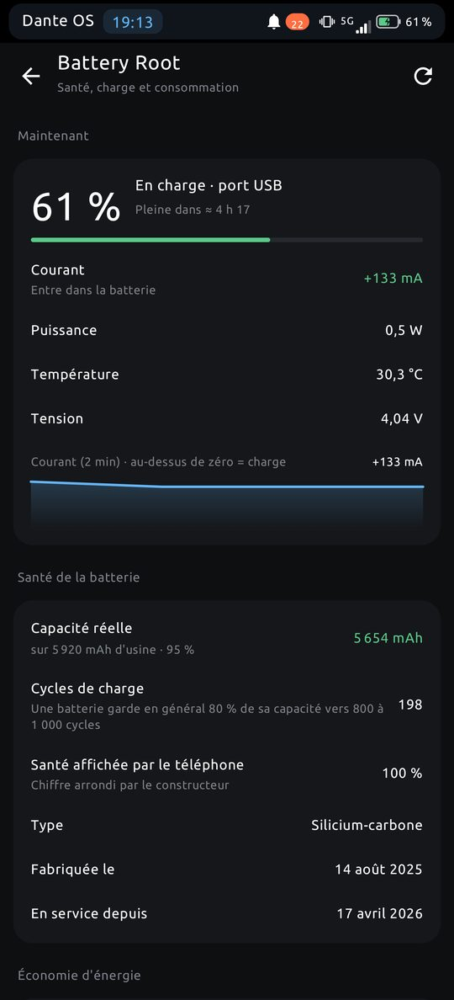
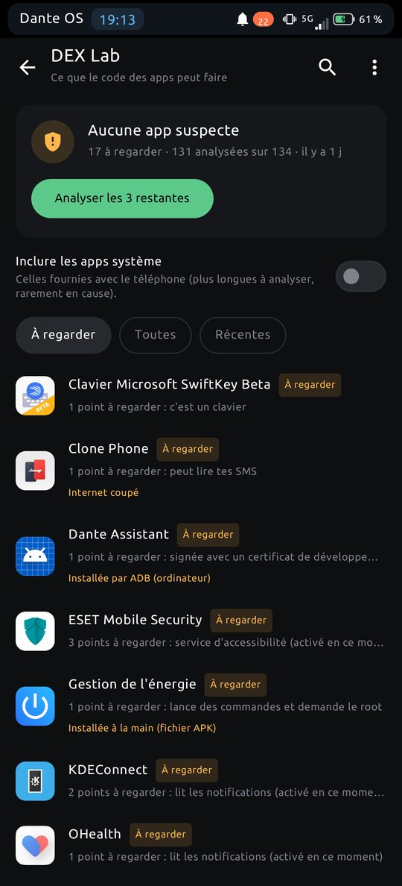
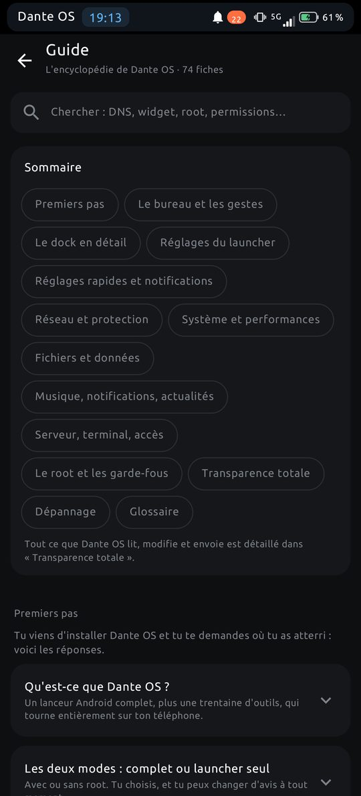

# Dante OS

**Le launcher root qui rend son téléphone à son propriétaire.** 
*The root launcher that gives a phone back to its owner.*

[**Télécharger / Download**](https://github.com/picqueanthony-arch/Dante-OS/releases/latest) · [Français](#français) · [English](#english)

   

---

## Français

Dante OS est un **launcher Android** (bureau en pages, dock, dossiers, widgets, tiroir d'apps) auquel s'ajoute, sur un téléphone **rooté**, une boîte à outils pour voir et décider ce que fait ton téléphone : qui parle sur le réseau, ce qui est bloqué, ce que consomme la batterie, comment tourne le processeur.

Sans root, il reste un launcher complet, avec les outils qui n'en ont pas besoin. Aucun traqueur, aucune statistique, aucun compte.

### Ce qu'il y a dedans

| | Module | Root |
|---|---|:---:|
| 🧱 | **Pare-feu** : pour chaque app, Wi-Fi, données mobiles, itinérance, réseau local. Règles iptables, IPv4 et IPv6. | oui |
| 🛡️ | **Filtre DNS** : pubs, pisteurs et sites malveillants bloqués pour tout le téléphone, listes à jour, règles perso. | oui |
| 📡 | **XRay** : trafic réseau app par app, connexions, alertes (nouveau serveur, envoi inhabituel). | oui |
| ⚙️ | **Governor** : profils processeur et puce graphique (économie, équilibré, performance). | oui |
| 🔋 | **Battery Root** : courant, puissance, vraie capacité et santé de la batterie. | oui |
| 🔍 | **DEX Lab** : analyse locale des apps installées (source, autorisations, pisteurs, signature). | non |
| 📁 | **Fichiers** : explorateur, SMB, FTP, SFTP, USB, coffre, corbeille. | non |
| 🖥️ | **SSH** : terminal, fichiers distants, serveurs enregistrés (mots de passe chiffrés dans le Keystore Android). | non |
| 🎵 | **Sonic** : lecteur audio avec égaliseur et listes de lecture. | non |
| 📰 | **Actualités**, **Labo JSON**, **Private Node** (suivi de ton propre serveur), **Telemetry** (widgets), **Notifications**, **journaux** et **diagnostic** de l'appareil. | non |
| 📖 | **Guide** : une encyclopédie intégrée de 74 fiches (gestes, modules, transparence totale). | non |

   

### Transparence

Dante OS fait le contraire de ce qu'on voit d'habitude : il explique ce qu'il fait.

- **Aucun traqueur, aucune statistique.** Rien n'est envoyé « pour améliorer le service ».
- **Tes données restent sur le téléphone.** Dante n'appelle que ce dont il a besoin pour ce que *tu* lui demandes : les listes du filtre DNS, tes flux d'actualités, tes propres serveurs.
- **Mots de passe chiffrés** dans le Keystore Android (AES-GCM).
- **Le root, pour voir et décider.** Chaque action sensible demande confirmation et se défait.
- Le Guide intégré liste, fiche par fiche, **ce que l'app lit, modifie et envoie**.

**Le code source n'est pas publié** (choix de l'auteur : l'outil touche au système). Ce que décrit le Guide se vérifie avec des outils Android ordinaires : liste des autorisations, trafic réseau, règles iptables.

Dante OS a été conçu, testé et corrigé par une seule personne, pendant huit mois, **avec l'aide d'une IA pour écrire le code**.

### Installer

Dante OS n'est pas sur le Play Store (root, filtrage réseau et accès aux apps ne sont pas compatibles avec ses règles).

**Avec Obtainium** (recommandé, il prévient des mises à jour) :
1. Installer [Obtainium](https://obtainium.imranr.dev/).
2. *Ajouter une app* → coller `https://github.com/picqueanthony-arch/Dante-OS`.

**À la main :** télécharger `Dante-OS-<version>.apk` dans la [dernière release](https://github.com/picqueanthony-arch/Dante-OS/releases/latest), vérifier l'empreinte (`sha256sum -c Dante-OS-<version>.apk.sha256`), installer.

Les mises à jour se font **par-dessus** : tes réglages sont gardés (même signature).

Au premier lancement, un accueil en 4 étapes fait le diagnostic du téléphone, te laisse choisir *Mode complet (root)* ou *Launcher seul*, et propose de définir Dante OS comme écran d'accueil. Pour revenir à ton ancien launcher : Réglages Android → Apps → Apps par défaut → Application d'accueil.

### Compatibilité

- **Android 10 ou plus.** Processeurs ARM 64 bits et 32 bits.
- Testé sur **OnePlus 13** (Android 15, root), **Galaxy Note 9** (Android 10, root) et **Galaxy Tab A 10.1** (Android 11, sans root). Ailleurs, certaines fonctions peuvent différer : le diagnostic de l'accueil te le dit.
- **Français et anglais** (réglable dans *À propos*).

### À savoir

- Fourni **« tel quel », sans garantie**. Tu es responsable de ce que tu actives : le root est puissant, une mauvaise manipulation peut perturber le téléphone.
- Dante OS n'est pas un antivirus : ses audits informent, ils ne jugent pas.
- Il ne contourne aucune protection pour débloquer des fonctions payantes.
- Le nom « Dante OS » et son logo restent la propriété de l'auteur.

Un bug, une omission ? Ouvre *Logs appareil* dans l'app, exporte le journal, et décris ce qui s'est passé (heure, module, ce que tu attendais) dans les [Issues](https://github.com/picqueanthony-arch/Dante-OS/issues).

Si Dante OS te sert, tu peux soutenir le projet : [PayPal](https://www.paypal.me/dante14250). C'est facultatif.

---

## English

Dante OS is an **Android launcher** (paged desktop, dock, folders, widgets, app drawer) with, on a **rooted** phone, a toolbox to see and decide what your phone does: who talks on the network, what gets blocked, what the battery really does, how the processor runs.

Without root it stays a complete launcher, with the tools that don't need it. No tracker, no statistics, no account.

### What's inside

| | Module | Root |
|---|---|:---:|
| 🧱 | **Firewall**: per app, Wi-Fi, mobile data, roaming, local network. iptables rules, IPv4 and IPv6. | yes |
| 🛡️ | **DNS filter**: ads, trackers and malicious sites blocked phone-wide, updated lists, custom rules. | yes |
| 📡 | **XRay**: per-app network traffic, connections, alerts (new server, unusual upload). | yes |
| ⚙️ | **Governor**: processor and GPU profiles (economy, balanced, performance). | yes |
| 🔋 | **Battery Root**: current, power, real capacity and battery health. | yes |
| 🔍 | **DEX Lab**: local analysis of installed apps (source, permissions, trackers, signature). | no |
| 📁 | **Files**: explorer, SMB, FTP, SFTP, USB, vault, trash. | no |
| 🖥️ | **SSH**: terminal, remote files, saved servers (passwords encrypted in the Android Keystore). | no |
| 🎵 | **Sonic**: audio player with equalizer and playlists. | no |
| 📰 | **News**, **JSON Lab**, **Private Node** (watch your own server), **Telemetry** (widgets), **Notifications**, device **logs** and **diagnostics**. | no |
| 📖 | **Guide**: a built-in encyclopedia of 74 pages (gestures, modules, total transparency). | no |

### Transparency

Dante OS does the opposite of the usual: it explains what it does.

- **No tracker, no statistics.** Nothing is sent "to improve the service".
- **Your data stays on the phone.** Dante only contacts what it needs for what *you* ask: DNS filter lists, your news feeds, your own servers.
- **Encrypted passwords** in the Android Keystore (AES-GCM).
- **Root to see and decide.** Every sensitive action asks for confirmation and can be undone.
- The built-in Guide lists, page by page, **what the app reads, changes and sends**.

**The source code is not published** (the author's choice: the tool touches the system). What the Guide describes can be checked with ordinary Android tools: permission list, network traffic, iptables rules.

Dante OS was designed, tested and fixed by one person over eight months, **with the help of an AI to write the code**.

### Install

Dante OS is not on the Play Store (root, network filtering and app access don't fit its rules).

**With Obtainium** (recommended, it tells you about updates):
1. Install [Obtainium](https://obtainium.imranr.dev/).
2. *Add app* → paste `https://github.com/picqueanthony-arch/Dante-OS`.

**By hand:** download `Dante-OS-<version>.apk` from the [latest release](https://github.com/picqueanthony-arch/Dante-OS/releases/latest), check the checksum (`sha256sum -c Dante-OS-<version>.apk.sha256`), install.

Updates install **over** the existing app: your settings are kept (same signature).

On first launch a 4-step welcome checks your phone, lets you pick *Full mode (root)* or *Launcher only*, and offers to set Dante OS as your home screen. To go back to your old launcher: Android Settings → Apps → Default apps → Home app.

### Compatibility

- **Android 10 or newer.** 64-bit and 32-bit ARM processors.
- Tested on **OnePlus 13** (Android 15, rooted), **Galaxy Note 9** (Android 10, rooted) and **Galaxy Tab A 10.1** (Android 11, not rooted). Elsewhere some features may differ: the welcome diagnostic tells you.
- **French and English** (switch in *About*).

### Good to know

- Provided **"as is", without warranty**. You are responsible for what you enable: root is powerful, a wrong move can disturb the phone.
- Dante OS is not an antivirus: its audits inform, they do not judge.
- It does not bypass protections to unlock paid features.
- The name "Dante OS" and its logo remain the property of the author.

A bug or an omission? Open *Device logs* in the app, export the log, and describe what happened (time, module, what you expected) in the [Issues](https://github.com/picqueanthony-arch/Dante-OS/issues).

If Dante OS is useful to you, you can support the project: [PayPal](https://www.paypal.me/dante14250). It's optional.
